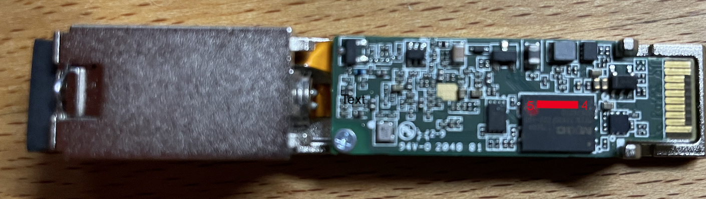

# G-010S-A Unbricking

If anything goes wrong during an update the SFP module can be unbricked via
NetConsole or a serial console.

## Preparation / Unlock Bootloader
<a id="preparation"></a>

By default the bootloader is locked and will not display a serial console / will
not allow interrupting the boot. NetConsole is also disabled by default.

After enabling any of the below make sure to check that ```bootdelay``` is set
to a suitable value (i.e., a value greater than 0).

### Enabling Serial Console and NetConsole

WARNING: Opening the serial console could cause the "pin 6" issue ([known
compatibility](README.md#compatibility)).

To unlock the bootloader and enable serial and NetConsole while the SFP module
still working:

```
ONTUSER@SFP:~# serial open
disabled serial and enable present pin
```

To disable the serial console again use:

```
ONTUSER@SFP:~# serial close
disabled serial and enable present pin
```

#### NetConsole Compatibility

NetConsole does not work in all circumstances. It seems to come down to specific
hardware combinations:

| SFP Module Model  | SFP Host                  | NetConsole working |
|-------------------|---------------------------|--------------------|
| 3FE46541AAAA      | BCM57810S                 | Requires config    |
| 3FE46541AAAA      | Media Converter           | Unstable           |
| 3FE46542AABA      | MC220L                    | Y                  |
| 3FE46541AADA      | 10Gtek WG-33-1GX1GT-SFP   | Y                  |
| 3FE46541AADA      | Netgear GS752TPV2         | Y                  |
| 3FE46541AADA      | CSR305                    | Pin 6 issue        |

##### Configure BCM57810S

For the NetConsole to work on BCM57810S hosts a configuration change is
needed to set the Serdes interface to SGMII. Use ediag in engineering mode:

```
device 1
nvm cfg
11 ;                (phy)
131=0 ;             change from SFI to SGMII
save
exit
```

To reset to SFI:

```
device 1
nvm cfg
11 ;                (phy)
131=2 ;             change back to SFI
save
exit
```

#### Configure NetConsole Host

To also start NetConsole you need to set the target host for the console
input/output: ``` ONTUSER@SFP:~# fw_setenv ncip 192.168.1.1 ``` Replace the IP
address with the right value for your network. It must be an address that is
reachable directly by the SFP as no gateway is configured by default. The IP
needs to respond to a ping at the time the SFP boots to start the NetConsole.

## U-boot Connection Using NetConsole

Reminder: The IP for the NetConsole client needs to be in the same subnet as
the SFP module (```192.168.1.X``` by default).

NetConsole uses UDP on port 6666. Run a NetConsole client on the machine
specified by ```ncip```, e.g., netcat. With netcat it is necessary to map the
interrupt signal from "Ctlr-C" to another key:

```
# stty intr ^K
# nc -u -l -p 6666
netconsole enabled
Press SPACE to delay and Ctrl-C to abort autoboot in 5 seconds

 
FALCON => 
```

After pressing "Ctrl-C" followed by "Enter" you will see the prompt for the
u-boot console. Press "Ctrl-K" to terminate the NetConsole. To reset the normal
behavior for "Ctrl-C" use:

```
# stty intr ^C
```

At the end of the session reset the module to run the regular boot:

```
FALCON => reset
```

## U-Boot Connection Using the Serial Console

The serial console allows access to the u-boot console using a UART to SFP
cable.

### Serial Console Cable

One tested UART board is Diligent PmodUSBUART. Ideally the UART board provides
3.3V for the SFP module. The SFP connector (e.g., Molex 74441-0010) is connected
to the UART on 4 pins:

| UART Board Pin | SFP Pin  |
| -------------- | ---------|
| TX             | 3        |
| RX             | 6        |
| GND            | 10       |
| 3.3V           | 15,16    |

One option is to solder it to a universal printed circuit board or similar.
Another option that worked well is to solder flat band cables straight to the
connector and then glue the connector to a surface board with epoxy glue.

The 3.3V connection from the UART will likely provide enough power to get to
u-boot and through the early kernel boot. It will likely not be enough to fully
boot up and activate the GPON and ethernet interface. Reaching the interface
initialization will then cause a restart of the module.

### Connecting to the Console

Connect to the UART with 115200 baud, e.g.:

```
screen /dev/tty.usb-device 115200
```

Then connect the SFP module to the Molex connector.  If the bootloader is
unlocked the boot prompt looks like this:

```
ROM: V1.1.4
ROM: CFG 0x00000006
ROM: SFLASH-4
Chip:  FALCON-S (A22)
Bootmode: 0x06
Reset cause: Power-On Reset
CPU Clock: 400 MHz
Net:   SGMII, SERDES [PRIME]
Press SPACE to delay and Ctrl-C to abort autoboot in 5 seconds
FALCON =>
```
Press Ctrl-C to abort the boot to get u-boot access, you will see the
prompt for the u-boot console.

If the bootloader is still locked there is no option to interrupt the
boot (or even this level of boot message). In that case see [Unbrick
Unprepared SFP Modules](#unlock_bricked).

## Using the U-boot Prompt

### Fixing Environment Issues

If the bricking was caused by a bad u-boot environment it can be fixed using
``setenv``. After changing the environment use ``saveenv`` to make the changes
permanent.

For example, if the active image 1 is not bootable, but image 0 is still
bootable then use:

```
setenv next_active 0
setenv commit 1
saveenv
```

### Replacing Firmware

Credit to anon23891239 describing it [here](https://forum.openwrt.org/t/support-ma5671a-sfp-gpon/48042/24).

If no bootable firmware image is left the images can be replaced via u-boot.
The two images are stored at 0xC0000(length 0x600000) and 0x6C0000(length
0x600000) respectively.

#### Transfer Firmware Via Network

##### Using NetConsole

One option for network transfer is to use the NetConsole connection,
e.g., using socat

```
socat udp-listen:6666 SYSTEM:/path/to/script
```

The script interrupts the boot and transfers a file to the SFP module:

```
expect -c '
  expect "Press SPACE"
  send -- "\003"
  expect "FALCON"
  send -- "loadx 0x80800000\n"
'
sx /path/to/firmware.bin
```

After the script terminates the file is transferred and you can
connect to the NetConsole via netcat to flash the firmware:

```
nc -u -p 6666 192.168.1.10 6666
```

In this case netcat is used in client mode as the NetConsole is
already set up but not sending any data actively.

##### Using TFTP

If there is a tftp server available the firmware image can also be
transferred via TFTP (replace 192.168.1.1 with your TFTP server):

```
FALCON => setenv serverip 192.168.1.1
FALCON => tftpboot 0x80800000 /path/to/tfp_image
```

#### Transfer Firmware Via Serial Cable

With a serial cable you can upload a firmware image onto the machine using a
Kermit transfer (use loady for YMODEM, loadx for XMODEM):

```
FALCON => loadb 0x80800000
## Ready for binary (kermit) download to 0x80800000 at 115200 bps...
```

Once the file is transferred you can flash the firmware.

#### Flash Firmware

Firmware can be flashed using ```sf``` in u-boot. For example, to replace
the first image with an image loaded to 0x80800000 and activate it use: 

```
FALCON => sf probe 0
FALCON => sf erase C0000 600000
FALCON => sf write 80800000 C0000 600000
FALCON => setenv commit 0
FALCON => setenv next_active 0
FALCON => saveenv
```

## Unbrick Unprepared SFP Modules
<a id="unlock_bricked"></a>

If a SFP module is bricked but it is not prepared with the above then it's still
possible to unbrick, but it requires opening the module and temporarily shorting
pins to cause the regular boot to fail.

Credit to hakan describing this [here](https://forum.openwrt.org/t/will-gpon-nokia-g-010s-a-change-sn/69602).

### Short the Flash and Boot

Pins 4 and 5 on the flash chip need to he shorted temporarily to interrupt the
boot process (e.g., with some tweezers). Then connect the SFP to the UART board.

With the pins shortened the SFP module will not be able to read the boot loader
from the flash chip, making it fall back into a recovery mode that allows
uploading a new boot loader.



Once the boot prompt is visible remove the short between the pins.

### Upload Temp Loader

With the shorted flash chip the boot ends up in the recovery console:

```
ROM: V1.1.4
ROM: CFG 0x00000006
ROM: SFLASH-4
ROM: CFG 0x00000006
ROM: SFLASH-4
ROM: CFG 0x00000006
ROM: SFLASH-4
ROM: CFG 0x00000006
ROM: SFLASH-4
ROM: CFG 0x00000006
ROM: SFLASH-4
ROM: CFG 0x00000006
ROM: SFLASH-4
ROM: CFG 0x00000006
ROM: SFLASH-4
ROM: CFG 0x00000006
ROM: SFLASH-4
ROM: CFG 0x00000006
ROM: SFLASH-4
ROM: CFG 0x00000006
ROM: SFLASH-4
ROM: Boot? (0-9A-F<CR>)
```
Enter 7 as the boot option, this will start an XMODEM transfer.

```
ROM: CFG 0x00000007
ROM: XMODEM
CCCC
```

Upload [1224ABORT.bin](bootloader/1224ABORT.bin) via XMODEM.

This will drop into a regular u-boot prompt.

```
CCCC
Sending 1224ABORT.bin, 1582 blocks: Give your local XMODEM receive command now.
Bytes Sent: 202624   BPS:7712

Transfer complete

Board: SFP
DRAM:  64 MiB
Now running in RAM - U-Boot at: 83fc8000
SF: Detected MX25L12805D with page size 64 KiB, total 16 MiB
Chip:  FALCON-S (A22)
Bootmode: 0x07
Reset cause: Power-On Reset
CPU Clock: 400 MHz
Net:   SGMII, SERDES [PRIME]
Press SPACE to delay and Ctrl-C to abort autoboot in 5 seconds
FALCON =>
```

### Update the Environment to Enable Serial Console / NetConsole

Manually do the setup that would be done with ```serial open``` during the
preparation step:

```
FALCON => setenv asc0 0
FALCON => setenv preboot run start_netconsole
```

To get a NetConsole also set the IP:
```
FALCON => setenv ncip 192.168.1.1
```

Check ```bootdelay``` to ensure that it is greater than 0.

Finally save the changes:

```
FALCON => saveenv
```

The next boot should then provide a prompt on the serial console or NetConsole.
